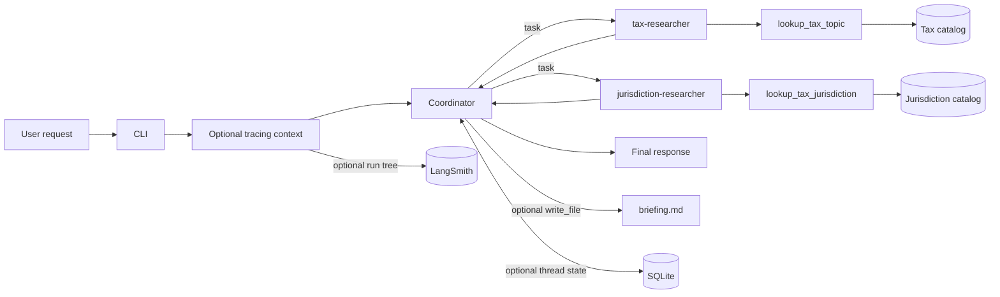

## Learn the system one boundary at a time

The fastest way to understand a deep agent is to make every component earn its
place. We will build an educational tax briefing agent from a deterministic
catalog, then add delegation, a second specialist, file artifacts, durable
conversation state, and tracing. Each stage changes one architectural boundary
while keeping the earlier behavior intact.

The completed application contains:

* A coordinator that plans work and synthesizes the answer
* A `tax-researcher` for income, property, and sales tax concepts
* A `jurisdiction-researcher` for federal, state, and local scope
* One deterministic catalog tool per specialist
* An optional confined filesystem for Markdown briefings
* Optional SQLite checkpoints for resumable conversation threads
* Optional LangSmith tracing for behavior inspection and evaluation

The example is educational. It is not tax advice, and its small local catalogs
are intentionally not authoritative tax sources.

## See the finished architecture



The coordinator owns planning and synthesis. Specialists own narrow research
jobs. Tools own deterministic facts. Persistence and observability wrap the
graph instead of changing those responsibilities.

## Prepare the project

You need Python 3.11 or later, `uv`, and Azure CLI for live Azure OpenAI calls.
Check the installed commands:

```bash
python3 --version
uv --version
az version
```

On macOS, install missing tools with Homebrew:

```bash
brew install uv
brew install azure-cli
```

Create the environment and install the locked project wheel:

```bash
uv sync --no-editable
```

This project uses a `src` layout and a non-editable wheel because some Python
builds skip Hatchling's hidden editable-install `.pth` file. If the default
package host is unavailable, use the configured mirror explicitly:

```bash
uv sync --no-editable \
  --default-index https://pypi.tuna.tsinghua.edu.cn/simple
```

After synchronization, examples use `uv run --offline --no-sync`. The first
flag avoids package-index access; the second preserves the installed wheel.

## Inspect before making a model call

Inspection mode needs no credentials and incurs no model usage:

```bash
uv run --offline --no-sync deep-agent-learning --inspect
```

The output names the local model alias, Azure deployment, underlying model, and
both delegation paths:

```text
Model: azure-openai
Azure deployment: DeepAgent_Learning
Underlying model: gpt-5-mini (2025-08-07)
Coordinator: plans and synthesizes the briefing
  -> task(subagent_type='tax-researcher')
Tax researcher: researches concepts in an isolated context
  -> lookup_tax_topic(topic)
Coordinator: routes jurisdiction research
  -> task(subagent_type='jurisdiction-researcher')
Jurisdiction researcher: researches where rules apply
  -> lookup_tax_jurisdiction(jurisdiction)
Result: returns to the coordinator for the final answer
```

`azure-openai` is the application's alias. `DeepAgent_Learning` is the Azure
deployment name, which currently points to `gpt-5-mini` version `2025-08-07`.
The inspection branch in [`cli.py`](../src/deep_agent_learning/cli.py) returns
before graph construction.

## Build a deterministic tool

Open [`tools.py`](../src/deep_agent_learning/tools.py). `TAX_CATALOG` stores a
small set of known facts, and `lookup_tax_topic` normalizes its input before
performing an exact lookup. Unknown values produce a list of supported topics
instead of an invented answer.

Deep Agents can expose an ordinary typed Python function as a tool. Its name,
parameter types, and docstring tell the model how to call it. Test the function
without an LLM:

```bash
uv run --offline --no-sync python -c \
  "from deep_agent_learning import lookup_tax_topic; print(lookup_tax_topic('sales tax'))"

uv run --offline --no-sync python -c \
  "from deep_agent_learning import lookup_tax_topic; print(lookup_tax_topic('estate tax'))"
```

The deterministic boundary is useful for learning and testing. A failed lookup
can be diagnosed without paying for a model call or reasoning about prompts.

## Give the tool to a specialist

Open [`agent.py`](../src/deep_agent_learning/agent.py) and find
`tax_researcher`. Five fields define its contract:

```python
tax_researcher = {
    "name": "tax-researcher",
    "description": "Look up and compare tax concepts using the local catalog...",
    "system_prompt": "You are an educational tax researcher...",
    "tools": [lookup_tax_topic],
    "model": model,
}
```

The name identifies the specialist in a `task` call. The description tells the
coordinator when to delegate. The prompt establishes grounding constraints. The
tool list limits the specialist's custom capabilities, and the model performs
the reasoning.

The specialist receives an isolated context window. Its detailed tool activity
does not fill the coordinator's conversation; only its result returns through
the built-in `task` tool.

## Register the coordinator

`create_agent` passes the model, coordinator prompt, and specialist definitions
to `create_deep_agent`. The result is a compiled LangGraph graph, not an immediate
model call.

The coordinator prompt describes the routing policy and synthesis constraints.
Registering a subagent gives the coordinator access to `task`, which creates the
delegation boundary. The graph later loops through model and tool calls until the
coordinator produces a final response.

The CLI invokes it with the standard LangGraph message shape:

```python
result = agent.invoke(
    {"messages": [{"role": "user", "content": question}]}
)
```

This is the central idea: a deep agent is not one larger prompt. It is an agent
harness that combines planning, tools, context management, delegation, and graph
execution around a model.

## Authenticate to Azure without an API key

Copy the tracked configuration template:

```bash
cp .env.example .env
```

Set the endpoint and deployment for your Azure OpenAI resource:

```dotenv
AZURE_OPENAI_ENDPOINT="https://<resource-name>.openai.azure.com/"
AZURE_OPENAI_CHAT_DEPLOYMENT="<deployment-name>"
AZURE_OPENAI_API_VERSION="2024-10-21"
```

These values identify the service; they are not credentials. The ignored `.env`
file remains local. Shell values take precedence because `load_dotenv` uses
`override=False`.

[`models.py`](../src/deep_agent_learning/models.py) creates a bearer-token
provider with `DefaultAzureCredential`. For local development, sign in with Azure
CLI and choose the intended subscription:

```bash
az login
az account set --subscription "<subscription-name-or-id>"
```

Your identity needs the `Cognitive Services OpenAI User` role on the Azure
OpenAI resource. No `AZURE_OPENAI_API_KEY` is required. The same code can use a
managed identity when hosted in Azure.

## Run the first live request

The default request compares sales tax with income tax:

```bash
uv run --offline --no-sync deep-agent-learning
```

Pass another question as the positional argument:

```bash
uv run --offline --no-sync deep-agent-learning \
  "Explain income tax and identify who pays it and when it is collected"
```

> [!NOTE]
> Live commands send requests to the Azure deployment and may incur usage
> charges. Inspection, direct tool calls, tests, and linting do not call a model.

For the default request, the coordinator delegates to `tax-researcher`, which
looks up both concepts and returns grounded facts. The coordinator then
synthesizes the comparison and adds the required jurisdiction caveat.

## Extend a capability without changing orchestration

Property tax demonstrates the smallest useful extension. Because it is another
tax concept, it belongs in `TAX_CATALOG`; it does not justify another specialist.

The focused tests in [`test_agent.py`](../tests/test_agent.py) establish that
lookup is case-insensitive and that unknown topics list every supported value:

```python
def test_lookup_property_tax_is_case_insensitive() -> None:
    result = lookup_tax_topic("  PROPERTY Tax ")

    assert "owner" in result
    assert "local tax authority" in result
```

The catalog gains one entry while the tool signature, specialist, coordinator,
invocation shape, and authentication remain unchanged. Rebuild the non-editable
wheel after editing source:

```bash
uv sync --no-editable --reinstall-package deep-agent-learning --offline
uv run --offline --no-sync pytest -q tests/test_agent.py -k lookup_tax_topic
```

Without the reinstall, Python may import the previously installed catalog even
though the source file contains the new entry.

## Add a specialist when responsibility changes

Jurisdiction research is different from adding another catalog fact. It answers
where rules apply, uses a separate data source, and introduces a routing choice.
That is a meaningful specialist boundary.

`JURISDICTION_CATALOG` and `lookup_tax_jurisdiction` follow the same deterministic
normalization and fallback pattern as the topic tool. Test both paths directly:

```bash
uv run --offline --no-sync python -c \
  "from deep_agent_learning import lookup_tax_jurisdiction; print(lookup_tax_jurisdiction('state'))"

uv run --offline --no-sync python -c \
  "from deep_agent_learning import lookup_tax_jurisdiction; print(lookup_tax_jurisdiction('international'))"
```

`jurisdiction_researcher` receives only `lookup_tax_jurisdiction`, while
`tax_researcher` receives only `lookup_tax_topic`. Their descriptions and prompts
reinforce the same distinction used by the coordinator:

1. Concept-only requests use `tax-researcher`.
2. Scope-only requests use `jurisdiction-researcher`.
3. Mixed requests use both before synthesis.

The construction test replaces `create_deep_agent` with a capture function. It
asserts the registered names, isolated tool lists, grounding language, and
mixed-request policy without constructing a live agent.

```bash
uv run --offline --no-sync pytest -q \
  tests/test_agent.py -k registers_specialists
```

> [!IMPORTANT]
> Prompts guide routing and grounding, but they are not an enforcement boundary.
> Strict provenance requires application-level validation against captured tool
> results or deterministic rendering from those results.

## Persist a briefing in a confined workspace

Deep Agents includes file tools. Passing `--workspace` connects them to a host
directory through `FilesystemBackend`:

```python
backend = (
    FilesystemBackend(root_dir=workspace, virtual_mode=True)
    if workspace is not None
    else None
)
```

`virtual_mode=True` anchors incoming paths to the configured root and rejects
traversal outside it. This project chooses `FilesystemBackend`, not
`LocalShellBackend`, because file persistence does not require shell execution.

> [!IMPORTANT]
> Use a dedicated artifact directory. Do not expose the repository root, home
> directory, or a directory containing secrets to the agent.

When a workspace is present, the CLI asks the coordinator to write
`/briefing.md`. The virtual path maps to `artifacts/briefing.md` on the host:

```bash
uv run --offline --no-sync deep-agent-learning \
  --workspace artifacts \
  "Create a concise briefing about property tax and local jurisdiction."
```

After invocation, deterministic CLI code checks `Path.is_file()`. A model saying
it wrote a file is not proof of a side effect. The CLI returns failure if the
artifact is absent and prints the resolved host path on success.

The repository ignores `artifacts/`. Confirm generated output and local
configuration remain untracked:

```bash
git check-ignore -v artifacts/briefing.md .env
```

## Resume a conversation with SQLite

Artifacts persist deliverables, not graph state. SQLite checkpointing lets a
later process resume the messages and execution state associated with a thread.

`create_agent` accepts a generic `BaseCheckpointSaver`, while the CLI owns the
local `SqliteSaver` connection lifecycle. The database and thread options are a
pair: either provide both or neither.

```bash
uv run --offline --no-sync deep-agent-learning \
  --checkpoint-db .deep-agent/checkpoints.sqlite \
  --thread-id learning-demo \
  "Explain property tax in one sentence, and remember my code word is cedar."

uv run --offline --no-sync deep-agent-learning \
  --checkpoint-db .deep-agent/checkpoints.sqlite \
  --thread-id learning-demo \
  "What code word did I give you, and which topic did we discuss?"
```

The saver remains open while LangGraph reads and writes checkpoints. A later
process reopens the same database, and `configurable.thread_id` selects the state
history. A different thread ID starts a separate history in the same database.

Thread IDs partition state; they do not authorize access. Production systems
must associate threads with authenticated users and enforce ownership.

These persistence mechanisms solve different problems:

| Mechanism | Persists | Lookup key | Example |
| --- | --- | --- | --- |
| Checkpointer | Graph state in one conversation | Thread ID | Resume messages |
| Filesystem backend | User-facing deliverables | File path | `briefing.md` |
| Long-term store | Facts beyond one thread | Namespace and key | User preferences |

The ignored `.deep-agent/` directory can contain messages, model responses, tool
results, and graph state. Treat it as application data, not source code.

## Trace and evaluate behavior

LangSmith tracing is opt-in because traces can contain prompts, responses, tool
arguments, results, metadata, and errors. Add a real key only to the ignored
`.env` file:

```dotenv
LANGSMITH_API_KEY="<langsmith-api-key>"
LANGSMITH_PROJECT="deep-agent-learning"
```

LangSmith does not reuse Azure CLI authentication. Before a live traced call,
the CLI validates `LANGSMITH_API_KEY`; a missing key returns exit code 2 before
the Azure model is invoked.

Inspection remains credential-free:

```bash
uv run --offline --no-sync deep-agent-learning \
  --inspect \
  --trace \
  --trace-project tax-learning
```

Upload one mixed run after configuring the key:

```bash
uv run --offline --no-sync deep-agent-learning \
  --trace \
  --trace-project tax-learning \
  "Compare property tax with state and local tax jurisdictions."
```

The tracing context attaches a project name, stable tags, and non-secret
metadata around graph invocation. `Client.flush()` runs in a `finally` block so
buffered trace operations can complete before the short-lived CLI exits.

The implementation and tracing lifecycle are covered by offline tests. A hosted
trace still requires your LangSmith credential and must be verified in the
LangSmith project UI.

## Evaluate traces against expectations

A trace is evidence, not a passing grade. Compare the run tree with an explicit
behavior matrix:

| Request type | Expected route | Expected evidence |
| --- | --- | --- |
| Tax concept only | `tax-researcher` | `lookup_tax_topic` call |
| Jurisdiction only | `jurisdiction-researcher` | `lookup_tax_jurisdiction` call |
| Mixed concept and scope | Both specialists | Both deterministic tools |
| Artifact request | Relevant specialists and filesystem | `write_file` and host file |
| Follow-up in a thread | Route using restored context | Same checkpoint thread ID |

Review four dimensions:

* Routing correctness: the coordinator selects the responsible specialist
* Tool grounding: specialists call catalogs and avoid unsupported facts
* Completion: the requested response or artifact exists
* Efficiency: unnecessary specialist, model, and tool calls are absent

Independent work can appear in different orders. Evaluate whether required work
happened, not whether every run tree is identical. Once expectations stabilize,
encode them as evaluators and run them against a versioned dataset.

> [!WARNING]
> Use synthetic or approved data. Do not trace credentials, personal tax records,
> taxpayer identifiers, or other sensitive information.

For a production system, define access, retention, deletion, masking, and
environment-separation policies before collecting telemetry.

## Verify the complete project

Rebuild the wheel, then run all offline checks:

```bash
uv sync --no-editable --reinstall-package deep-agent-learning --offline
uv run --offline --no-sync pytest -q
uv run --offline --no-sync ruff check .
```

The tests cover deterministic lookup behavior, graph registration, filesystem
configuration, artifact verification, checkpoint wiring, trace configuration,
trace flushing, model metadata, dotenv loading, and credential failure paths.

## Carry the pattern into another domain

The runtime mechanisms are domain-neutral. Keep model resolution, Azure keyless
authentication, filesystem confinement, checkpointing, and tracing unless the
target environment requires a deliberate change.

Migrate the domain through these boundaries:

1. Replace the local catalogs and lookup functions with target-domain sources.
2. Define specialists around distinct responsibilities, not lists of keywords.
3. Give each specialist only the tools required for its job.
4. Rewrite coordinator routing and synthesis constraints using the new contracts.
5. Replace the default question, artifact language, trace tags, and inspection text.
6. Rewrite tests to assert the new facts, routes, tool isolation, and side effects.
7. Run offline tests before any live model or tracing call.

The repository includes the
[`migrate-deep-agent-domain` skill](../.github/skills/migrate-deep-agent-domain/SKILL.md)
to guide that workflow. Invoke `/migrate-deep-agent-domain` and describe the
target domain, specialist responsibilities, trusted knowledge sources, expected
artifact, and safety constraints.

## What the sequence teaches

New facts usually belong in an existing tool. New responsibility boundaries may
justify another specialist. Side effects need deterministic verification.
Conversation state, artifacts, and long-term memory are different persistence
problems. Tracing reveals behavior, while evaluation decides whether that
behavior meets explicit expectations.

Those distinctions matter more than the tax vocabulary. They are the reusable
design lessons behind this Deep Agents example.
