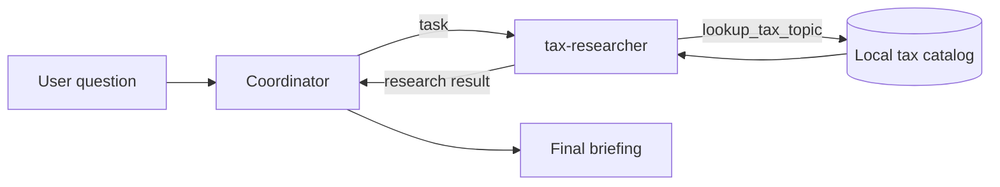

## Why start with a small agent team

An agent becomes easier to understand when every moving part has a visible job.
This first article in the Deep Agents learning series uses a deliberately small
example: a coordinator receives a tax question, delegates research to a specialist,
and turns the specialist's findings into a final briefing.

The finished application has one coordinator, one `tax-researcher` subagent, and
one deterministic Python tool. It uses LangChain Deep Agents for orchestration and
an Azure OpenAI deployment for reasoning. Local authentication comes from your
Azure CLI session, so no API key is stored in the project.

By the end, you will be able to:

* Explain the difference between a coordinator, subagent, and tool
* Inspect the agent structure without calling a model
* Authenticate to Azure OpenAI with `az login`
* Run the complete delegation flow from the command line
* Identify the code responsible for each step

## The application we are building

Suppose a user asks the following question:

> Compare sales tax and income tax. Explain who pays each and when it is
> collected.

A single model could answer directly, but that would hide the architecture we want
to learn. Our coordinator must delegate tax research to a specialist. The
specialist retrieves facts through a local tool, then returns its result to the
coordinator.



This separation gives each component a narrow responsibility:

* The coordinator plans, delegates, and synthesizes
* The subagent performs focused tax research in an isolated context
* The tool supplies deterministic facts from a known local catalog
* The model decides when to delegate and when to call a tool

The example is educational rather than a source of personal tax advice. Real tax
rules vary by jurisdiction.

## Step 1: Check the prerequisites

You need macOS, Python 3.11 or later, `uv`, and the Azure CLI. Check what is already
installed before asking Homebrew to install anything:

```bash
python3 --version
uv --version
az version
```

Install only the missing commands:

```bash
brew install uv
brew install azure-cli
```

> [!NOTE]
> Homebrew can return a nonzero exit code when an installation encounters an
> existing package or another local configuration issue. If `uv --version` and
> `az version` both work, continue to the next step.

## Step 2: Create the project environment

From the repository root, let `uv` create the virtual environment and install the
locked dependencies and project wheel:

```bash
uv sync --no-editable
```

This repository uses a `src` layout. Some recent Python builds skip hidden `.pth`
files, including the file generated for Hatchling's editable install. Installing
the project wheel with `--no-editable` keeps package imports and the console command
reliable across those builds.

This project previously encountered network failures when downloading package
files from the default PyPI CDN. If the normal command fails for that reason, use
the reachable Tsinghua mirror:

```bash
uv sync --no-editable \
  --default-index https://pypi.tuna.tsinghua.edu.cn/simple
```

The main dependencies in `pyproject.toml` have distinct jobs:

* `deepagents` builds the coordinator and subagent graph
* `langchain-openai` provides the Azure chat-model integration
* `azure-identity` obtains Microsoft Entra tokens from local credentials
* `pytest` and `ruff` validate behavior and code quality

After synchronization, use `uv run --offline --no-sync` for local commands. The
`--no-sync` option preserves the wheel installation, and `--offline` avoids
contacting a package index again.

## Step 3: Inspect the agent before running it

Start with inspection mode:

```bash
uv run --offline --no-sync deep-agent-learning --inspect
```

Inspection does not authenticate to Azure and does not make a paid model call. The
output describes both the configured model and the control flow:

```text
Model: azure-openai
Azure deployment: DeepAgent_Learning
Underlying model: gpt-5-mini (2025-08-07)
Coordinator: plans and synthesizes the briefing
  -> task(subagent_type='tax-researcher')
Subagent: researches in an isolated context
  -> lookup_tax_topic(topic)
Result: returns to the coordinator for the final answer
```

There are two model names because they serve different purposes. `azure-openai` is
the application's local model alias. `DeepAgent_Learning` is the Azure deployment
name, and that deployment currently points to `gpt-5-mini` version `2025-08-07`.

The `--inspect` branch lives in
[`cli.py`](../../../src/deep_agent_learning/cli.py). It returns before
`create_agent` is called, which is why inspection needs no credentials.

## Step 4: Understand the deterministic tool

Open [`tools.py`](../../../src/deep_agent_learning/tools.py). The module contains a
small `TAX_CATALOG` and this typed function:

```python
def lookup_tax_topic(topic: str) -> str:
    """Look up a short, educational definition in the local tax catalog."""
```

Deep Agents exposes ordinary Python functions as model-callable tools. The
function name, parameter type, and docstring tell the model what the tool does and
how to call it.

Try it without an agent or model:

```bash
uv run --offline --no-sync python -c \
  "from deep_agent_learning import lookup_tax_topic; print(lookup_tax_topic('sales tax'))"
```

You should receive the catalog definition for sales tax. Try an unknown topic too:

```bash
uv run --offline --no-sync python -c \
  "from deep_agent_learning import lookup_tax_topic; print(lookup_tax_topic('estate tax'))"
```

Instead of inventing an answer, the function reports that there is no exact match
and lists the known topics. This predictable behavior is useful while learning:
when a live run behaves unexpectedly, you can test the tool independently.

## Step 5: Build the specialist subagent

Open [`agent.py`](../../../src/deep_agent_learning/agent.py) and find the
`tax_researcher` dictionary. Four fields define the specialist:

```python
tax_researcher = {
    "name": "tax-researcher",
    "description": "Look up and compare tax concepts using the local catalog...",
    "system_prompt": "You are an educational tax researcher...",
    "tools": [lookup_tax_topic],
    "model": model,
}
```

Each field influences the runtime differently:

* `name` identifies the specialist in a coordinator `task` call
* `description` helps the coordinator decide when to delegate
* `system_prompt` defines the specialist's role and boundaries
* `tools` determines which custom capabilities the specialist can use
* `model` selects the reasoning model for the specialist

The subagent works in an isolated context. Its tool calls and intermediate
messages do not fill the coordinator's conversation. Only the research result
returns through the `task` tool.

## Step 6: Build the coordinator

The same `create_agent` function passes the specialist to
`create_deep_agent`:

```python
return create_deep_agent(
    model=model,
    system_prompt=(
        "You coordinate educational tax briefings. Plan the request, delegate "
        "tax research to tax-researcher with the task tool, then synthesize a "
        "concise answer. State that actual rules vary by jurisdiction."
    ),
    subagents=[tax_researcher],
)
```

`create_deep_agent` returns a compiled LangGraph graph. It does not call the model
during construction. Registering `tax-researcher` gives the coordinator access to
the built-in `task` tool, which creates the delegation boundary shown during
inspection.

The prompts are intentionally explicit. The coordinator is told to delegate, and
the specialist is told to call `lookup_tax_topic` for every requested topic. That
makes the first example easier to trace than a loosely prompted general agent.

## Step 7: Understand keyless Azure authentication

Open [`models.py`](../../../src/deep_agent_learning/models.py). The application
loads Azure configuration from a local `.env` file without overriding values
already exported in your shell:

```python
def configure_azure_environment(dotenv_path: str | Path | None = None) -> None:
  """Load Azure configuration from a dotenv file without replacing shell values."""
  load_dotenv(dotenv_path=dotenv_path, override=False)
```

Create the local file from the tracked template, then replace its placeholders
with your Azure resource endpoint and deployment name:

```bash
cp .env.example .env
```

The `.env` file identifies a service; it does not contain an API key. It remains
local because Git ignores it, while `.env.example` documents the required keys.
The function uses `DefaultAzureCredential` and a bearer-token provider for this
scope:

```text
https://cognitiveservices.azure.com/.default
```

For local development, `DefaultAzureCredential` can use your Azure CLI login. Sign
in and inspect the active subscription:

```bash
az login
az account show --output table
```

Select another subscription when necessary:

```bash
az account set --subscription "<subscription-name-or-id>"
```

> [!IMPORTANT]
> Your signed-in identity needs the `Cognitive Services OpenAI User` role on the
> `deepagent-learning` Azure AI resource. The application does not need
> `AZURE_OPENAI_API_KEY`.

Shell environment variables take precedence because `load_dotenv` is called with
`override=False`. This allows automation and hosted environments to supply the
same configuration without changing the local file.

## Step 8: Run the first live request

The default command sends a comparison question to Azure:

```bash
uv run --offline --no-sync deep-agent-learning
```

You can also supply a question as the positional argument:

```bash
uv run --offline --no-sync deep-agent-learning \
  "Explain income tax and identify who pays it and when it is collected"
```

> [!NOTE]
> A live command sends requests to the Azure model deployment and may incur usage
> charges. Inspection, tool calls made directly from Python, tests, and linting do
> not call the model.

The command-line path in [`cli.py`](../../../src/deep_agent_learning/cli.py) builds
the graph and invokes it with the standard LangGraph message shape:

```python
result = agent.invoke(
    {"messages": [{"role": "user", "content": question}]}
)
```

The graph then loops through model and tool calls until the coordinator produces a
final response. The CLI prints the content of the last message in the returned
state.

## Step 9: Trace one request end to end

For the default comparison, the conceptual sequence is:

1. The CLI wraps the question in a user message.
2. `create_agent` resolves `azure-openai` to an `AzureChatOpenAI` instance.
3. The coordinator reads the request and calls `task` for `tax-researcher`.
4. The specialist calls `lookup_tax_topic("sales tax")`.
5. The specialist calls `lookup_tax_topic("income tax")`.
6. The specialist summarizes the retrieved facts for the coordinator.
7. The coordinator compares the concepts and adds the jurisdiction caveat.
8. The CLI prints the final coordinator message.

This is the central Deep Agents idea: the application is not one oversized prompt.
It is an agent harness that combines a model with delegation, tools, context
isolation, planning, and a graph execution loop.

## Step 10: Verify the local behavior

Run the test suite and linter before changing the example:

```bash
uv run --offline --no-sync pytest
uv run --offline --no-sync ruff check .
```

The Part 1 suite contained nine tests. They verify the tool, inspection output,
dotenv loading, environment overrides, model pass-through behavior, and the
public OpenAI missing-key error. The tests do not make paid model calls.

Read [`test_agent.py`](../../../tests/test_agent.py) after the implementation. The
tests provide a compact statement of the behavior that should remain stable while
you experiment.

## Continue to the first extension

[Part 2](../02-extend-the-tax-tool/README.md) adds `property tax` to the local
catalog with a focused test. The extension changes the data available to the
specialist without changing the orchestration, reinforcing the boundary between
domain capability and agent control flow.

## What we learned

The coordinator owns planning and synthesis. The specialist owns focused research.
The tool owns deterministic domain data. Azure OpenAI supplies reasoning, while
`DefaultAzureCredential` keeps authentication out of source code.

Keeping those responsibilities separate gives us a foundation we can extend one
concept at a time. Later parts of the series can add multiple specialists,
filesystem-backed artifacts, durable conversation state, and tracing without
having to replace this core mental model.

## Series roadmap

The planned progression builds on this repository:

1. Build and trace the first coordinator, subagent, and tool (this article).
2. [Extend the tax tool with property tax](../02-extend-the-tax-tool/README.md).
3. [Add a jurisdiction specialist and learn delegation boundaries](../03-add-a-jurisdiction-specialist/README.md).
4. Give the agent a filesystem workspace and produce briefing artifacts.
5. Add checkpointing so work can pause and resume.
6. Add tracing and evaluate coordinator and subagent behavior.
