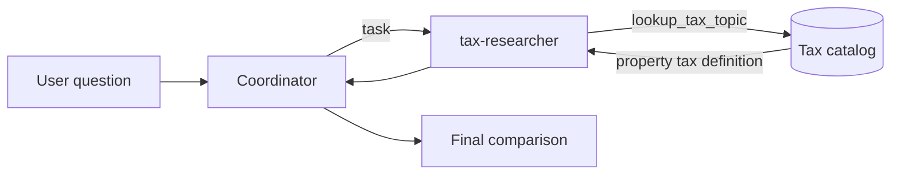

## Start with the smallest useful extension

[Part 1](../01-first-deep-agent/README.md) built a coordinator, a
`tax-researcher` subagent, and a deterministic lookup tool. The agent could
research income tax and sales tax, but asking the tool about property tax
returned an unknown-topic message.

Part 2 adds property tax without changing the coordinator, specialist prompt,
or graph. This small experiment isolates an important agent-design principle:
when the orchestration is sound, a new domain capability may require only a tool
change.

By the end, you will be able to:

* Extend a deterministic tool without modifying agent control flow
* Protect normalization and fallback behavior with focused tests
* Rebuild a non-editable local package after changing source code
* Verify the extension without making a paid model call
* Ask the live agent to compare the new topic with an existing one

## See the capability boundary

The architecture remains the same:



Only the catalog changes. The coordinator still decides when to delegate, and
the specialist still decides when to call `lookup_tax_topic`.

This distinction helps keep agent code maintainable. Domain facts belong in the
domain tool. Planning and delegation rules belong in the agent definitions.

## Step 1: Observe the old behavior

Before the extension, this direct tool call returned `No exact match`:

```bash
uv run --offline --no-sync python -c \
  "from deep_agent_learning import lookup_tax_topic; print(lookup_tax_topic('property tax'))"
```

Calling the function directly is faster and more precise than invoking the whole
agent. It also makes no model request, so this feedback loop is free and
deterministic.

## Step 2: Define the behavior with tests

Open [`test_agent.py`](../../../tests/test_agent.py). The new positive test uses
mixed capitalization and surrounding whitespace:

```python
def test_lookup_property_tax_is_case_insensitive() -> None:
    result = lookup_tax_topic("  PROPERTY Tax ")

    assert "owner" in result
    assert "local tax authority" in result
```

The input deliberately exercises the existing normalization logic. A catalog
extension should not require callers to match storage capitalization exactly.

Property tax used to be the unsupported example, so the fallback test now asks
for estate tax and verifies that all three supported topics are listed:

```python
def test_lookup_tax_topic_lists_known_topics_for_unknown_value() -> None:
    result = lookup_tax_topic("estate tax")

    assert "No exact match" in result
    assert "income tax" in result
    assert "property tax" in result
    assert "sales tax" in result
```

Together, these tests define two behaviors: property tax is supported, and truly
unknown topics still produce a useful discovery message.

## Step 3: Add property tax to the catalog

Open [`tools.py`](../../../src/deep_agent_learning/tools.py) and add one entry to
`TAX_CATALOG`:

```python
"property tax": (
    "Property tax is generally assessed on the value of owned real estate or other "
    "property. The owner commonly pays it to a local tax authority on a recurring basis."
),
```

The wording follows the existing catalog style:

* It remains educational rather than jurisdiction-specific
* It explains the usual tax base
* It identifies who commonly pays
* It describes the general collection timing

No tool signature changes. The Deep Agents framework still exposes the same
function name, parameter, return type, and docstring to the specialist.

## Step 4: Rebuild the local package

This project uses a non-editable wheel installation because some Python builds
skip Hatchling's hidden editable-install `.pth` file. A source-only edit does not
always cause a normal `uv sync --no-editable` command to rebuild that wheel.
Force a reinstall of only the local project package:

```bash
uv sync --no-editable --reinstall-package deep-agent-learning --offline
```

Without this step, Python may import the previously installed catalog even though
the source file in your editor contains property tax.

## Step 5: Run focused verification

Start with the tests closest to the changed behavior:

```bash
uv run --offline --no-sync pytest -q \
  tests/test_agent.py -k lookup_tax_topic
```

The expected result is two passing tests. Then run the complete offline checks:

```bash
uv run --offline --no-sync pytest
uv run --offline --no-sync ruff check .
```

A direct lookup provides one more visible confirmation:

```bash
uv run --offline --no-sync python -c \
  "from deep_agent_learning import lookup_tax_topic; print(lookup_tax_topic('property tax'))"
```

The output should describe property value, the owner, a local tax authority, and
recurring payment.

## Step 6: Ask the live agent

Ensure `.env` contains your Azure OpenAI endpoint, deployment, and API version,
and authenticate locally:

```bash
az login
uv run --offline --no-sync deep-agent-learning \
  "Compare property tax and income tax. Explain who pays each and when it is collected."
```

This request may incur Azure model usage. The expected control flow is:

1. The coordinator delegates the comparison to `tax-researcher`.
2. The specialist looks up property tax.
3. The specialist looks up income tax.
4. The specialist returns the retrieved facts.
5. The coordinator synthesizes a comparison with a jurisdiction caveat.

The model chooses the calls, but the new property-tax facts come from the same
deterministic catalog verified by the offline tests.

## What changed and what did not

The extension changed:

* One catalog entry
* One new positive test
* One updated fallback test

The extension did not change:

* The coordinator prompt
* The `tax-researcher` definition
* The tool function signature
* The LangGraph invocation shape
* Azure authentication

That is the payoff of a clear tool boundary. We expanded what the specialist can
research without increasing orchestration complexity.

## What we learned

A deep agent does not need a new subagent for every new fact. Start by asking
which layer owns the capability. Property tax belongs beside the other tax topics,
so extending the catalog is enough.

Focused tests also reveal packaging problems quickly. In this experiment, a stale
installed wheel can look like a failed implementation. Reinstalling the local
package separates environment state from application behavior.

## Next in the series

[Part 3](../03-add-a-jurisdiction-specialist/README.md) adds a second specialist
for jurisdiction research. That change moves beyond domain data and introduces a
real delegation choice for the coordinator: which specialist should receive
which part of a request?

## Series roadmap

1. [Build and trace the first coordinator, subagent, and tool](../01-first-deep-agent/README.md).
2. Extend the tax tool with property tax (this article).
3. [Add a jurisdiction specialist and learn delegation boundaries](../03-add-a-jurisdiction-specialist/README.md).
4. [Give the agent a filesystem workspace and produce a briefing artifact](../04-write-a-briefing-artifact/README.md).
5. Add checkpointing so work can pause and resume.
6. Add tracing and evaluate coordinator and subagent behavior.
