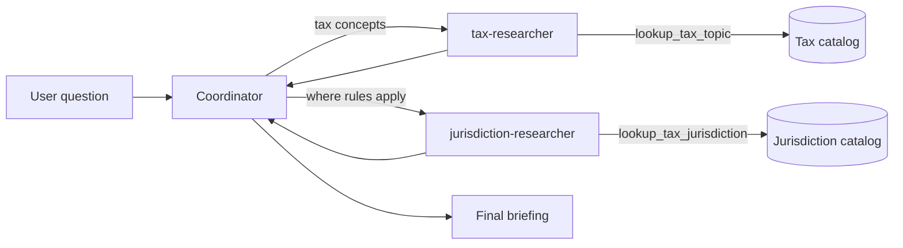

## Make the coordinator choose

[Part 1](../01-first-deep-agent/README.md) introduced one coordinator and one
specialist. [Part 2](../02-extend-the-tax-tool/README.md) expanded that
specialist's catalog without changing the graph. Those versions had delegation,
but they did not have a meaningful routing decision. Every research task went to
`tax-researcher`.

Part 3 creates that decision. Tax concepts and jurisdiction levels are different
responsibilities, so each receives its own deterministic tool and specialist.
The coordinator must now decide whether to call one specialist or both.

By the end, you will be able to:

* Define a second specialist with a focused responsibility
* Keep tools isolated by assigning each specialist only what it needs
* Describe routing rules in both specialist metadata and the coordinator prompt
* Test graph construction without calling Azure OpenAI
* Send a mixed request that requires the coordinator to use both specialists

## See the new delegation boundary

The team now has two research branches:



The split follows responsibility, not vocabulary alone:

* `tax-researcher` explains concepts such as income, property, and sales tax
* `jurisdiction-researcher` explains federal, state, and local authority levels
* The coordinator combines both results when a question crosses the boundary

This distinction matters. A new fact about property tax belonged in the existing
tax catalog in Part 2. Jurisdiction research adds a different kind of reasoning,
a different data source, and a distinct routing choice. That is enough to justify
a new specialist.

## Step 1: Add deterministic jurisdiction knowledge

The new catalog in `src/deep_agent_learning/tools.py` deliberately describes
levels of authority without claiming current rates or legal requirements:

```python
JURISDICTION_CATALOG = {
    "federal": (
        "A federal tax jurisdiction applies nationwide under the authority of the national "
        "government. Federal rules can coexist with state and local tax obligations."
    ),
    "local": (
        "A local tax jurisdiction is administered by a city, county, municipality, or similar "
        "authority. Local rules and rates can differ within the same state."
    ),
    "state": (
        "A state tax jurisdiction applies within one state. Each state can define its own tax "
        "bases, rates, filing requirements, and interactions with local taxes."
    ),
}
```

The lookup function uses the same normalization and fallback pattern as the tax
topic tool:

```python
def lookup_tax_jurisdiction(jurisdiction: str) -> str:
    normalized_jurisdiction = jurisdiction.strip().lower()
    if guidance := JURISDICTION_CATALOG.get(normalized_jurisdiction):
        return guidance

    known_jurisdictions = ", ".join(sorted(JURISDICTION_CATALOG))
    return (
        f"No exact match for '{jurisdiction}'. "
        f"Known jurisdiction levels: {known_jurisdictions}."
    )
```

Try both paths without an LLM:

```bash
uv run --offline --no-sync python -c \
  "from deep_agent_learning import lookup_tax_jurisdiction; print(lookup_tax_jurisdiction('state'))"

uv run --offline --no-sync python -c \
  "from deep_agent_learning import lookup_tax_jurisdiction; print(lookup_tax_jurisdiction('international'))"
```

The first command returns state-level guidance. The second lists the supported
levels: `federal`, `local`, and `state`.

## Step 2: Give the capability to one specialist

The second subagent is defined beside `tax_researcher` in
`src/deep_agent_learning/agent.py`:

```python
jurisdiction_researcher = {
    "name": "jurisdiction-researcher",
    "description": (
        "Explain federal, state, and local tax jurisdiction levels. Delegate here when a "
        "request asks where tax rules apply or how jurisdiction levels differ."
    ),
    "system_prompt": (
        "You are an educational tax jurisdiction researcher. Use lookup_tax_jurisdiction "
      "for every requested jurisdiction level. Return only facts present in the tool "
      "output. Do not add facts, examples, or advice from your own knowledge."
    ),
    "tools": [lookup_tax_jurisdiction],
    "model": model,
}
```

Three fields work together:

* `description` helps the coordinator choose this specialist
* `system_prompt` tells the specialist how to perform its assigned work
* `tools` limits its custom capability to jurisdiction lookup

The tax specialist does not receive `lookup_tax_jurisdiction`, and the
jurisdiction specialist does not receive `lookup_tax_topic`. This keeps each
specialist's action space aligned with its job.

## Step 3: Register the team

Defining a dictionary does not add a subagent to the graph. Both definitions must
be passed to `create_deep_agent`:

```python
return create_deep_agent(
    model=model,
    system_prompt=(
        "You coordinate educational tax briefings. Plan the request and delegate tax-concept "
        "questions to tax-researcher. Delegate questions about federal, state, or local "
        "jurisdiction levels to jurisdiction-researcher. Use both specialists when a request "
        "needs both kinds of research, then synthesize a concise answer using only facts "
        "returned by the specialists. Do not add rates, formulas, examples, procedures, or "
        "jurisdiction-specific claims from your own knowledge. State that actual rules vary "
        "by jurisdiction."
    ),
    subagents=[tax_researcher, jurisdiction_researcher],
)
```

The coordinator prompt names three routing cases:

1. Concept-only requests go to `tax-researcher`.
2. Scope-only requests go to `jurisdiction-researcher`.
3. Mixed requests use both specialists before synthesis.

The subagent descriptions and coordinator prompt reinforce the same boundary.
Descriptions expose available routes; the coordinator prompt explains how to
compose those routes for a larger task.

## Step 4: Inspect both routes offline

Rebuild the installed project wheel after changing source code:

```bash
uv sync --no-editable --reinstall-package deep-agent-learning --offline
```

Then inspect the team without credentials or a model call:

```bash
uv run --offline --no-sync python -m deep_agent_learning --inspect
```

The output now includes both branches:

```text
Coordinator: plans and synthesizes the briefing
  -> task(subagent_type='tax-researcher')
Tax researcher: researches concepts in an isolated context
  -> lookup_tax_topic(topic)
Coordinator: routes jurisdiction research
  -> task(subagent_type='jurisdiction-researcher')
Jurisdiction researcher: researches where rules apply
  -> lookup_tax_jurisdiction(jurisdiction)
Result: returns to the coordinator for the final answer
```

Inspection is useful for learning, but it is a hand-authored description. A test
must also verify the arguments passed to the Deep Agents factory.

## Step 5: Test the real registration call

The construction test replaces `create_deep_agent` with a capture function. It
can inspect the graph configuration without constructing a live model-backed
agent:

```python
def test_create_agent_registers_specialists_with_distinct_tools(monkeypatch) -> None:
    captured: dict[str, Any] = {}

    def capture_agent(**kwargs: Any) -> str:
        captured.update(kwargs)
        return "compiled-agent"

    monkeypatch.setattr("deep_agent_learning.agent.resolve_model", lambda model: model)
    monkeypatch.setattr("deepagents.create_deep_agent", capture_agent)

    assert create_agent("openai:test-model") == "compiled-agent"
    subagents = captured["subagents"]
    assert [subagent["name"] for subagent in subagents] == [
        "tax-researcher",
        "jurisdiction-researcher",
    ]
    assert subagents[0]["tools"] == [lookup_tax_topic]
    assert subagents[1]["tools"] == [lookup_tax_jurisdiction]
    assert "Return only facts present in the tool output" in subagents[0]["system_prompt"]
    assert "Return only facts present in the tool output" in subagents[1]["system_prompt"]
    assert "Use both specialists" in captured["system_prompt"]
    assert "using only facts returned by the specialists" in captured["system_prompt"]
```

This test catches mistakes that inspection alone cannot detect: forgetting to
register the specialist, assigning the wrong tool, removing mixed-request
routing, or dropping the coordinator's grounding contract.

Run all offline checks:

```bash
uv run --offline --no-sync pytest
uv run --offline --no-sync ruff check .
```

## Step 6: Ask a mixed question

Sign in before running the Azure-backed agent:

```bash
az login
az account set --subscription "<subscription-name-or-id>"
```

The local `.env` supplies the Azure endpoint, deployment, and API version. It is
ignored by Git; `.env.example` documents the required variable names.

Use one request that crosses the new boundary:

```bash
uv run --offline --no-sync python -m deep_agent_learning \
  "Explain property tax, then explain why local and state jurisdiction levels matter to the answer."
```

A sensible execution trace is:

1. The coordinator identifies a tax concept and two jurisdiction levels.
2. It delegates property tax to `tax-researcher`.
3. That specialist calls `lookup_tax_topic("property tax")`.
4. It delegates local and state scope to `jurisdiction-researcher`.
5. That specialist calls `lookup_tax_jurisdiction` for both levels.
6. The coordinator combines the returned facts and includes the required caveat.

The model controls the exact ordering and wording. The specialist descriptions,
prompts, and tool boundaries make the intended route explicit.

> [!IMPORTANT]
> Prompt instructions guide routing and grounding, but they are not an enforcement
> boundary. A live model can still paraphrase tool output or add connective
> interpretation. Applications that require strict provenance should validate the
> final response against captured tool results or render those results through
> deterministic application code.

## What changed

Part 3 adds:

* One jurisdiction catalog and lookup tool
* One `jurisdiction-researcher` definition
* Explicit coordinator rules for concept, scope, and mixed requests
* Inspection output for the second branch
* Offline tests for lookup behavior and actual specialist registration

It does not change Azure authentication, model resolution, the command-line
invocation shape, or the existing tax catalog.

## What we learned

Adding a specialist should introduce a real responsibility boundary. Two agents
with the same tools and overlapping descriptions make routing harder, not better.
Here, concepts and jurisdiction scopes are separable jobs with distinct data.

Tool isolation is also part of the design. A specialist with fewer, more relevant
tools gives the model a smaller decision surface and makes failures easier to
locate. The coordinator remains responsible for planning and synthesis; neither
specialist needs to understand the whole request.

Finally, test the graph configuration rather than trusting documentation about
it. Capturing the factory arguments provides a fast offline assertion of the
team you intended to build. It does not prove which route a probabilistic model
will choose for every prompt or guarantee that every final sentence came from a
tool.

## Next in the series

[Part 4](../04-write-a-briefing-artifact/README.md) gives the agent a confined
filesystem workspace and asks it to produce a briefing artifact. That experiment
moves results beyond the final chat message while preserving the two-specialist
team built here.

## Series roadmap

1. [Build and trace the first coordinator, subagent, and tool](../01-first-deep-agent/README.md).
2. [Extend the tax tool with property tax](../02-extend-the-tax-tool/README.md).
3. Add a jurisdiction specialist and learn delegation boundaries (this article).
4. [Give the agent a filesystem workspace and produce a briefing artifact](../04-write-a-briefing-artifact/README.md).
5. Add checkpointing so work can pause and resume.
6. Add tracing and evaluate coordinator and subagent behavior.
