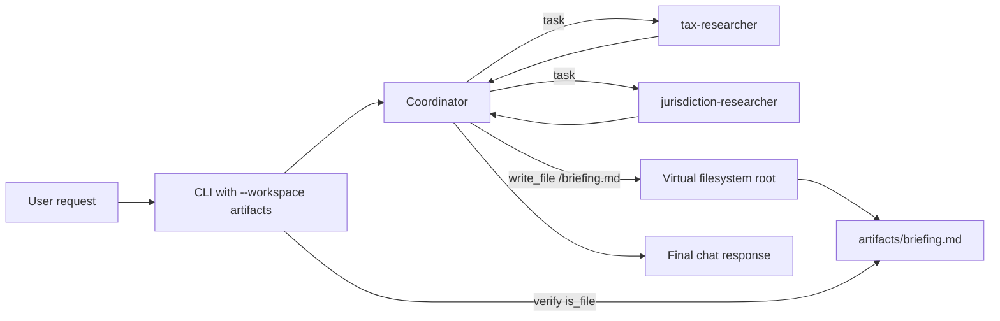

## Move the answer beyond chat

[Part 3](../03-add-a-jurisdiction-specialist/README.md) gave the coordinator a
real routing decision between tax-concept and jurisdiction specialists. Their
findings still disappeared into a final chat message when the process ended.

Part 4 asks the coordinator to create a durable Markdown artifact. This sounds
like a file-writing exercise, but the useful lesson is the boundary between an
agent's virtual path and the host filesystem.

By the end, you will be able to:

* Connect Deep Agents filesystem tools to a local directory
* Confine agent-visible paths with `virtual_mode=True`
* Persist `/briefing.md` without granting shell execution
* Verify artifact creation in deterministic CLI code
* Keep generated output and local secrets outside version control

## Understand the backend change

Deep Agents already includes tools such as `write_file`, `read_file`, `edit_file`,
`ls`, `glob`, and `grep`. Without an explicit host backend, those tools use agent
state rather than a selected persistent directory.

Part 4 supplies `FilesystemBackend` only when the user passes `--workspace`:



The model works with `/briefing.md`. The backend maps that virtual path to
`artifacts/briefing.md` on the host.

## Step 1: Choose the narrow backend

Deep Agents 0.7.11 provides both `FilesystemBackend` and `LocalShellBackend`.
This experiment needs file persistence, not command execution, so it uses
`FilesystemBackend`.

That choice matters:

* `FilesystemBackend` supports native file operations
* `LocalShellBackend` adds unrestricted local shell execution
* `StateBackend`, the default, keeps files in agent state rather than this host directory

The smallest sufficient capability is file access. Shell access would add risk
without helping the learning objective.

## Step 2: Create a virtual root

`create_agent` now accepts an optional `Path`:

```python
def create_agent(model_name: str, workspace: Path | None = None) -> Any:
    from deepagents import create_deep_agent
    from deepagents.backends import FilesystemBackend

    model = resolve_model(model_name)
    backend = (
        FilesystemBackend(root_dir=workspace, virtual_mode=True)
        if workspace is not None
        else None
    )
```

The backend is then passed to the graph factory:

```python
return create_deep_agent(
    model=model,
    system_prompt=coordinator_prompt,
    subagents=[tax_researcher, jurisdiction_researcher],
    backend=backend,
)
```

The actual source keeps the coordinator prompt inline; the abbreviated variable
above makes the backend change easier to see.

With `virtual_mode=True`, incoming paths are anchored to `root_dir`. Traversal
segments such as `..` and host paths outside that root are rejected. The backend
does not provide process isolation, but it limits the file surface exposed by
this local CLI.

> [!IMPORTANT]
> Point `--workspace` at a dedicated artifact directory. Do not use the repository
> root, your home directory, or any directory containing secrets. A filesystem
> backend gives the model read and write access within its configured root.

## Step 3: Add an explicit CLI contract

The new option uses `pathlib.Path` so path handling stays typed:

```python
parser.add_argument(
    "--workspace",
    type=Path,
    help="Persist a Markdown briefing in this local artifact directory.",
)
```

When the option is present, the CLI appends a concrete artifact instruction to
the user's request:

```python
question = args.question
if args.workspace is not None:
    question += (
        "\n\nAfter synthesizing the answer, use write_file to save the same briefing "
        "as Markdown at /briefing.md."
    )
```

The fixed virtual name keeps the first filesystem experiment traceable. The host
directory remains configurable, while the model always receives one unambiguous
target path.

## Step 4: Verify outside the model

A model saying "I saved the file" is not evidence that a file exists. After the
graph finishes, the CLI checks the host path directly:

```python
artifact_path = args.workspace / ARTIFACT_NAME
if not artifact_path.is_file():
    print(f"Expected artifact was not created: {artifact_path}", file=sys.stderr)
    return EXIT_FAILURE
print(f"Artifact: {artifact_path.resolve()}")
```

The command exits with status 1 when the requested artifact is missing. On
success, it prints the resolved host path. This creates a deterministic boundary
around a probabilistic action.

The check proves that a file exists. It does not prove that every sentence is
accurate, so the grounding limitation from Part 3 still applies.

## Step 5: Inspect without a model call

Rebuild the installed project wheel after changing source code:

```bash
uv sync --no-editable --reinstall-package deep-agent-learning --offline
```

Inspect the filesystem route without using Azure OpenAI:

```bash
uv run --offline --no-sync python -m deep_agent_learning \
  --inspect \
  --workspace artifacts
```

The final lines reveal both path views:

```text
Artifact workspace: /path/to/deep-agent-learning/artifacts
  -> write_file('/briefing.md')
```

The first path belongs to the host. The second belongs to the agent.

## Step 6: Test the boundary offline

The factory test captures what is passed to `create_deep_agent`:

```python
backend = captured["backend"]
assert type(backend).__name__ == "FilesystemBackend"
assert backend.cwd == tmp_path.resolve()
assert backend.virtual_mode is True
```

CLI tests cover both observable outcomes:

* A fake agent writes `briefing.md`, and the CLI reports its resolved path
* A fake agent skips the write, and the CLI returns `EXIT_FAILURE`

Run the focused checks:

```bash
uv run --offline --no-sync pytest -q tests/test_agent.py -k artifact
```

Then run the complete offline suite:

```bash
uv run --offline --no-sync pytest
uv run --offline --no-sync ruff check .
```

## Step 7: Create the live artifact

Authenticate with Azure CLI if the session has expired:

```bash
az login
az account set --subscription "<subscription-name-or-id>"
```

Run a mixed request that uses both specialists and the filesystem:

```bash
uv run --offline --no-sync python -m deep_agent_learning \
  --workspace artifacts \
  "Create a concise briefing that explains property tax and why state and local jurisdiction levels matter."
```

The successful run ends with a host path similar to:

```text
Artifact: /path/to/deep-agent-learning/artifacts/briefing.md
```

Open the artifact directly:

```bash
sed -n '1,120p' artifacts/briefing.md
```

In the validated run, the file contained a Markdown heading, the property-tax
catalog statement, federal, state, and local jurisdiction statements, and the
required caveat that actual rules vary by jurisdiction.

## Step 8: Keep generated output out of Git

The repository ignores the default example directory:

```gitignore
# Agent-generated artifacts
/artifacts/
```

This keeps a live model's generated output separate from reviewed source and
documentation. The `.env` file remains independently ignored as local
configuration.

Check both conditions after a live run:

```bash
git status --short
git check-ignore -v artifacts/briefing.md .env
```

Neither file should appear as an untracked change.

## What changed

Part 4 adds:

* An optional `FilesystemBackend` rooted at a caller-selected directory
* A `--workspace` CLI option
* A fixed virtual output path at `/briefing.md`
* Host-side verification and a failure exit code
* Offline construction and CLI tests
* A Git ignore rule for the example artifact directory

It does not add a dependency, enable shell execution, expose the repository root,
or change Azure authentication.

## What we learned

Filesystem tools and host persistence are separate decisions. Deep Agents can
reason about files in state, but a host backend is required when another process
must consume the artifact after invocation.

Virtual paths also make the prompt portable. The model writes `/briefing.md`
whether the host workspace is a relative `artifacts` directory or an absolute
temporary directory used by a test.

Most importantly, verify side effects outside the model. Prompt instructions are
intent; `Path.is_file()` is evidence. Content validation would be the next layer
for an application that needs stronger guarantees.

## Next in the series

[Part 5](../05-resume-with-checkpointing/README.md) adds SQLite checkpointing so
a conversation can pause and resume with the same thread state. The artifact
workspace remains separate from conversational state: one persists deliverables,
while the other persists graph progress.

## Series roadmap

1. [Build and trace the first coordinator, subagent, and tool](../01-first-deep-agent/README.md).
2. [Extend the tax tool with property tax](../02-extend-the-tax-tool/README.md).
3. [Add a jurisdiction specialist and learn delegation boundaries](../03-add-a-jurisdiction-specialist/README.md).
4. Give the agent a filesystem workspace and produce a briefing artifact (this article).
5. [Add SQLite checkpointing so work can pause and resume](../05-resume-with-checkpointing/README.md).
6. Add tracing and evaluate coordinator and subagent behavior.
