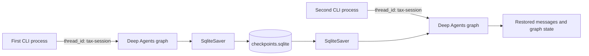

## Make a conversation survive the process

[Part 4](../04-write-a-briefing-artifact/README.md) persisted a deliverable after
the agent finished. The conversation itself still started from an empty state on
every command.

Part 5 gives LangGraph a SQLite checkpointer. A user can run the CLI, stop the
Python process, and later continue the same conversation by providing the same
database and thread ID.

By the end, you will be able to:

* Pass a checkpointer into `create_deep_agent`
* Store graph checkpoints in a local SQLite database
* Partition conversations with LangGraph thread IDs
* Resume one thread across separate CLI processes
* Distinguish checkpoints from artifacts and long-term memory

## See the new state boundary

The agent architecture does not gain another specialist or tool. The change sits
around the compiled graph:



The database survives process exit. The thread ID tells LangGraph which state
history to load from that database.

## Step 1: Add the SQLite saver

SQLite checkpointing lives in a separate official LangGraph package:

```bash
uv add "langgraph-checkpoint-sqlite>=3,<4"
```

The project keeps the version range explicit in `pyproject.toml`, and `uv.lock`
records the resolved package and transitive dependencies.

An in-memory saver would be enough for multiple turns inside one Python process.
It would disappear when this CLI exits, so it cannot prove the behavior this
experiment is meant to teach.

## Step 2: Expose the graph extension point

`create_agent` accepts any LangGraph `BaseCheckpointSaver`:

```python
def create_agent(
    model_name: str,
    workspace: Path | None = None,
    checkpointer: BaseCheckpointSaver | None = None,
) -> Any:
```

The graph factory receives it without changing the coordinator or specialists:

```python
return create_deep_agent(
    model=model,
    system_prompt=coordinator_prompt,
    subagents=[tax_researcher, jurisdiction_researcher],
    backend=backend,
    checkpointer=checkpointer,
)
```

The actual source keeps the coordinator prompt inline. The shortened variable
above isolates the new argument.

Keeping the saver generic matters. SQLite is appropriate for a local learning
project, while another environment can supply a different implementation without
rebuilding the agent team.

## Step 3: Require database and thread identity together

The CLI adds two options:

```python
parser.add_argument(
    "--checkpoint-db",
    type=Path,
    help="Persist conversation checkpoints in this SQLite database.",
)
parser.add_argument(
    "--thread-id",
    help="Resume the conversation associated with this checkpoint thread.",
)
```

They form one contract. A database without a thread does not identify which
conversation to load, and a thread without a database has nowhere persistent to
store its state.

The CLI rejects either incomplete form before constructing the model:

```python
if (args.checkpoint_db is None) != (args.thread_id is None):
    print(
        "--checkpoint-db and --thread-id must be provided together.",
        file=sys.stderr,
    )
    return EXIT_ERROR
```

Checkpointing remains opt-in, so every command from Parts 1 through 4 continues
to work without either option.

## Step 4: Own the saver lifecycle in the CLI

`SqliteSaver.from_conn_string` is a context manager. The CLI creates the parent
directory, opens the connection for graph construction and invocation, then
closes it when the command finishes:

```python
args.checkpoint_db.parent.mkdir(parents=True, exist_ok=True)
with SqliteSaver.from_conn_string(str(args.checkpoint_db)) as checkpointer:
    agent = create_agent(
        args.model,
        workspace=args.workspace,
        checkpointer=checkpointer,
    )
    result = agent.invoke(
        payload,
        config={"configurable": {"thread_id": args.thread_id}},
    )
```

The saver must remain open during invocation because LangGraph reads and writes
checkpoints while the graph runs.

## Step 5: Understand `thread_id`

The thread ID is part of LangGraph's invocation configuration, not the user's
message:

```python
config={"configurable": {"thread_id": "tax-session"}}
```

Invoking the graph again with the same database and `thread_id` restores that
thread's checkpointed state before processing the new message. Using a different
thread ID starts a separate history in the same database.

Thread IDs partition state. They are not authentication or authorization. A
production application must derive thread access from an authenticated user and
verify ownership rather than accepting arbitrary identifiers as proof of access.

## Step 6: Inspect without calling Azure OpenAI

Inspection mode shows the resolved database path and selected thread:

```bash
uv run --offline --no-sync python -m deep_agent_learning \
  --inspect \
  --checkpoint-db .deep-agent/checkpoints.sqlite \
  --thread-id tax-session
```

The output ends with:

```text
Checkpoint database: /path/to/deep-agent-learning/.deep-agent/checkpoints.sqlite
Thread ID: tax-session
```

This check confirms configuration, not saved conversational content.

## Step 7: Test the wiring offline

The factory test verifies that checkpointing is optional by default:

```python
assert captured["checkpointer"] is None
```

The CLI tests then verify the persistent path:

* A `SqliteSaver` reaches `create_agent`
* Invocation receives `configurable.thread_id`
* A nested database directory is created
* Supplying only one checkpoint option returns `EXIT_ERROR`

Run the focused tests:

```bash
uv sync --no-editable --reinstall-package deep-agent-learning --offline
uv run --offline --no-sync pytest -q tests/test_agent.py -k checkpoint
```

The package itself was also checked with a tiny LangGraph that wrote state,
closed the SQLite saver, reopened it, and recovered the same snapshot. That test
isolates storage lifetime from model behavior.

## Step 8: Resume a live conversation

The first command starts a thread and gives it a fact to remember:

```bash
uv run --offline --no-sync python -m deep_agent_learning \
  --checkpoint-db .deep-agent/checkpoints.sqlite \
  --thread-id part5-demo \
  "Explain property tax in one sentence, and remember that my project code word is cedar."
```

After that process exits, run a second command with the same database and thread:

```bash
uv run --offline --no-sync python -m deep_agent_learning \
  --checkpoint-db .deep-agent/checkpoints.sqlite \
  --thread-id part5-demo \
  "What project code word did I give you, and which tax topic did we discuss?"
```

The validated Azure OpenAI run answered:

```text
Your project code word is cedar, and we discussed property tax; actual rules vary by jurisdiction.
```

The second process had no command-line copy of the first message. It recovered
that context from the checkpoint associated with `part5-demo`.

## Step 9: Keep checkpoint state local

The repository ignores the example runtime directory:

```gitignore
# Local conversation checkpoints
/.deep-agent/
```

Checkpoints can contain user messages, model responses, tool results, and graph
state. Treat the database as application data:

* Do not commit it to Git
* Do not put credentials or secrets in prompts
* Restrict filesystem access according to your environment
* Define retention and deletion policies before using real user data
* Use an authenticated, production-grade store for a multi-user service

The application still obtains Azure credentials from `DefaultAzureCredential`.
Neither tokens nor `.env` configuration are intentionally added to graph state.

## Checkpoints, artifacts, and memory

These three persistence mechanisms solve different problems:

| Mechanism | Persists | Lookup key | Example |
| --- | --- | --- | --- |
| Checkpointer | Graph state within a conversation | Thread ID | Resume prior messages |
| Filesystem backend | User-facing deliverables | File path | `briefing.md` |
| Long-term store | Facts shared beyond one thread | Application namespace and key | User preferences |

Part 5 implements only the first row. Reusing a thread restores its execution
history; it does not create a governed memory profile that should follow a user
across unrelated conversations.

## What changed

Part 5 adds:

* The `langgraph-checkpoint-sqlite` dependency
* An optional checkpointer parameter on `create_agent`
* Paired `--checkpoint-db` and `--thread-id` CLI options
* LangGraph thread configuration during invocation
* Offline tests for configuration and failure behavior
* A Git ignore rule for local checkpoint state

It does not change the two-specialist team, Azure keyless authentication,
filesystem confinement, or artifact verification.

## What we learned

Persistence has two coordinates: a storage system and an identity within that
storage system. The SQLite path selects the store; the thread ID selects the
conversation.

Lifecycle is equally important. The saver must be open while the compiled graph
runs, but the connection can close after each command because SQLite retains the
checkpoints. Reopening the database in a later process is the behavior under test.

Finally, checkpointing is not a security boundary. Thread IDs make state
addressable. Authentication, authorization, encryption, retention, and deletion
remain application responsibilities.

## Next in the series

Part 6 will enable LangSmith tracing and inspect how coordinator, specialist,
tool, filesystem, and checkpoint activity appears across parent and child runs.
That visibility will prepare the project for behavior evaluation rather than
manual output inspection alone.

## Series roadmap

1. [Build and trace the first coordinator, subagent, and tool](../01-first-deep-agent/README.md).
2. [Extend the tax tool with property tax](../02-extend-the-tax-tool/README.md).
3. [Add a jurisdiction specialist and learn delegation boundaries](../03-add-a-jurisdiction-specialist/README.md).
4. [Give the agent a filesystem workspace and produce a briefing artifact](../04-write-a-briefing-artifact/README.md).
5. Add SQLite checkpointing so work can pause and resume (this article).
6. Add tracing and evaluate coordinator and subagent behavior.
