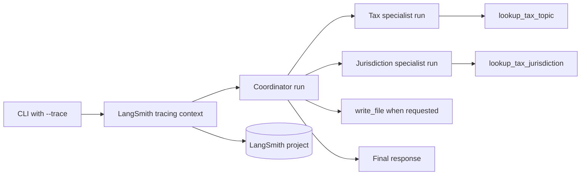

## Observe the system you built

[Part 5](../05-resume-with-checkpointing/README.md) made conversation state
survive across processes. By that point, the application could route to two
specialists, call deterministic tools, write a Markdown artifact, and resume a
thread. Terminal output showed the final answer, but not the complete execution
that produced it.

Part 6 adds opt-in LangSmith tracing around the compiled graph. One run tree can
show the coordinator, delegated specialist work, tool calls, model calls, and
latency. That evidence turns architectural expectations into behavior you can
inspect and evaluate.

By the end, you will be able to:

* Enable tracing for one CLI invocation
* Group runs under a named LangSmith project
* Add stable tags and non-secret metadata
* Flush buffered trace operations before process exit
* Evaluate routing, grounding, artifacts, and thread continuity from evidence

## See the observability boundary

Tracing wraps the existing invocation rather than changing the graph:



The checkpointer and filesystem backend still own persistence. LangSmith receives
telemetry about the execution.

## Step 1: Declare the tracing dependency

LangSmith arrived transitively through LangChain, but application code now
imports it directly. The project therefore declares its own supported range:

```bash
uv add "langsmith>=0.11,<0.12"
```

Direct dependencies make the application's contract visible and prevent an
unrelated transitive upgrade from silently removing an imported API.

## Step 2: Configure credentials outside code

Remote LangSmith tracing uses a LangSmith API key. It does not reuse Azure CLI
authentication because LangSmith and Azure OpenAI are separate services.

The tracked `.env.example` documents the optional settings:

```dotenv
# Optional: required only when running with --trace
LANGSMITH_API_KEY="<langsmith-api-key>"
LANGSMITH_PROJECT="deep-agent-learning"
```

Put the real key in the ignored `.env` file or your shell environment. Never
commit it.

Azure OpenAI authentication remains unchanged: `DefaultAzureCredential` obtains
an Azure token from `az login` locally or managed identity in Azure.

## Step 3: Make tracing explicit

The CLI adds an enable switch and a project selector:

```python
parser.add_argument(
    "--trace",
    action="store_true",
    help="Upload the run tree to LangSmith using LANGSMITH_API_KEY.",
)
parser.add_argument(
    "--trace-project",
    default=os.environ.get("LANGSMITH_PROJECT", DEFAULT_TRACE_PROJECT),
    help="LangSmith project for traced runs (default: %(default)s).",
)
```

Tracing is off by default. Existing commands do not upload telemetry unless the
caller passes `--trace`.

The project name defaults to `LANGSMITH_PROJECT` when configured, then falls back
to `deep-agent-learning`. The command-line option can override either value for
one run.

## Step 4: Fail before the model call

The application loads `.env`, then validates the tracing credential:

```python
if args.trace and not os.environ.get("LANGSMITH_API_KEY"):
    print(
        "LANGSMITH_API_KEY is required when --trace is enabled.",
        file=sys.stderr,
    )
    return EXIT_ERROR
```

A missing key returns exit code 2 before creating the agent or making a paid
Azure OpenAI request.

Inspection remains credential-free. This command describes the intended tracing
configuration without uploading anything:

```bash
uv run --offline --no-sync python -m deep_agent_learning \
  --inspect \
  --trace \
  --trace-project tax-learning
```

The output ends with:

```text
LangSmith tracing: enabled
Trace project: tax-learning
```

## Step 5: Scope tracing to one invocation

The CLI creates a LangSmith client only when tracing is enabled. It then builds a
scoped context:

```python
trace_scope = tracing_context(
    enabled=True,
    project_name=args.trace_project,
    tags=["deep-agent-learning", "tax-briefing"],
    metadata={
        "model": args.model,
        "thread_id": args.thread_id or "not-configured",
        "artifact_enabled": args.workspace is not None,
    },
    client=trace_client,
)
```

The graph runs inside that context. LangChain and LangGraph propagate the active
tracing context through model, tool, and subagent calls.

The metadata describes execution configuration without copying credentials into
the trace. Do not add tokens, connection strings, or `.env` values to metadata.

## Step 6: Keep persistence paths composable

Part 6 extracts graph invocation into one helper. That helper preserves the two
paths built earlier:

* Without checkpointing, build the graph and invoke it directly
* With checkpointing, open `SqliteSaver`, pass `configurable.thread_id`, and invoke

The tracing context wraps either path:

```python
with trace_scope:
    result = invoke_agent(args, payload)
```

The same approach also works when `--workspace` asks the agent to write
`/briefing.md`. Tracing observes these features; it does not replace them.

## Step 7: Flush before exit

The LangSmith client can batch trace operations. A short-lived CLI must flush
them before the process exits:

```python
finally:
    if trace_client is not None:
        trace_client.flush()
```

The `finally` block also runs when agent construction or invocation raises the
configuration error handled by this CLI. Successfully buffered telemetry gets a
chance to complete before control returns to the shell.

After a traced run, the CLI prints the project name:

```text
LangSmith project: tax-learning
```

That line confirms the target project, not remote ingestion. Open LangSmith to
verify that the run arrived.

## Step 8: Test without a network call

The tracing tests replace the SDK boundaries with small fakes. They prove that:

* Missing `LANGSMITH_API_KEY` returns `EXIT_ERROR`
* `--inspect --trace` works without a key
* The selected project reaches `tracing_context`
* Stable tags and expected metadata are attached
* The graph runs inside the tracing scope
* `Client.flush()` runs before exit

Run the focused checks:

```bash
uv sync --no-editable --reinstall-package deep-agent-learning --offline
uv run --offline --no-sync pytest -q tests/test_agent.py -k trace
```

These tests validate application wiring. They intentionally do not upload test
data to LangSmith.

## Step 9: Upload a live trace

Add a real `LANGSMITH_API_KEY` to `.env`, keep the Azure settings from earlier
parts, and sign in to Azure if needed:

```bash
az login
```

Run a request that requires both specialists:

```bash
uv run --offline --no-sync python -m deep_agent_learning \
  --trace \
  --trace-project tax-learning \
  "Compare property tax with state and local tax jurisdictions."
```

This repository's implementation and offline lifecycle tests were validated, but
a hosted trace was not uploaded while writing this part because no
`LANGSMITH_API_KEY` was available in the environment.

## Step 10: Inspect the run tree

Open the `tax-learning` project in LangSmith and select the new root run. For the
mixed request above, inspect these behaviors:

1. The coordinator receives the complete user request.
2. A `task` call delegates the tax concept to `tax-researcher`.
3. `tax-researcher` calls `lookup_tax_topic` with `property tax`.
4. Another `task` call delegates jurisdiction scope to `jurisdiction-researcher`.
5. `jurisdiction-researcher` calls `lookup_tax_jurisdiction` for `state` and `local`.
6. The coordinator synthesizes the specialist results.
7. The final answer includes the caveat that actual rules vary by jurisdiction.

The exact ordering of independent specialist work can vary. Evaluate whether the
required work happened and whether the final answer stayed within returned facts,
not whether every trace has an identical shape.

## Step 11: Turn observations into evaluation criteria

Use a small set of requests with explicit expectations:

| Request type | Expected route | Expected evidence |
| --- | --- | --- |
| Tax concept only | `tax-researcher` | `lookup_tax_topic` call |
| Jurisdiction only | `jurisdiction-researcher` | `lookup_tax_jurisdiction` call |
| Mixed concept and scope | Both specialists | Both deterministic tools |
| Artifact request | Relevant specialists and filesystem | `write_file` plus host file |
| Follow-up in a thread | Route based on restored context | Same checkpoint thread ID |

For each trace, evaluate four dimensions:

* Routing correctness: the coordinator selects the specialist that owns the work
* Tool grounding: specialists call their catalogs and do not invent unsupported facts
* Completion: the requested answer or artifact exists
* Efficiency: unnecessary specialist, model, and tool calls are absent

Start with manual review while the dataset is small. Once expectations stabilize,
encode them as LangSmith evaluators and run them against a versioned dataset.

## Step 12: Protect traced data

Traces can contain prompts, model responses, tool arguments, tool results,
metadata, and errors. Treat them as application telemetry with user content.

> [!WARNING]
> Do not trace credentials, personal tax records, taxpayer identifiers, or other
> sensitive data in this educational project. Use synthetic prompts and catalog
> facts.

For a real application:

* Apply least-privilege access to LangSmith projects
* Define retention and deletion policies
* Separate development, test, and production projects
* Review input and output masking options before collecting user data
* Avoid placing sensitive values in tags, metadata, thread IDs, or project names
* Confirm organizational approval before sending telemetry to an external service

Tracing should improve accountability without expanding the data exposure beyond
what the application owner has approved.

## What changed

Part 6 adds:

* A direct LangSmith dependency
* Optional `--trace` and `--trace-project` arguments
* Credential validation before live invocation
* Scoped tags and non-secret execution metadata
* A shared invocation helper for checkpointed and non-checkpointed runs
* Explicit trace flushing for the short-lived CLI
* Offline tests for the complete tracing lifecycle
* Optional LangSmith settings in `.env.example`

It does not change Azure keyless authentication, coordinator routing, specialist
prompts, deterministic catalogs, filesystem confinement, or SQLite checkpoints.

## What we learned

Observability belongs around the behavior being observed. The tracing context
wraps graph invocation, so the graph remains usable without LangSmith and tracing
remains opt-in.

A trace is evidence, not a passing grade. It reveals which routes and tools ran;
evaluation compares that evidence with explicit expectations. Keeping those two
concepts separate makes failures easier to diagnose.

Finally, telemetry is another data boundary. Explicit enablement, external
credentials, stable project names, minimal metadata, and deliberate retention are
part of the implementation, not administrative details to postpone.

## Series complete

The six experiments now form one incremental Deep Agents example:

1. [Build and trace the first coordinator, subagent, and tool](../01-first-deep-agent/README.md).
2. [Extend the tax tool with property tax](../02-extend-the-tax-tool/README.md).
3. [Add a jurisdiction specialist and learn delegation boundaries](../03-add-a-jurisdiction-specialist/README.md).
4. [Give the agent a filesystem workspace and produce a briefing artifact](../04-write-a-briefing-artifact/README.md).
5. [Add SQLite checkpointing so work can pause and resume](../05-resume-with-checkpointing/README.md).
6. Trace and evaluate coordinator and subagent behavior (this article).
